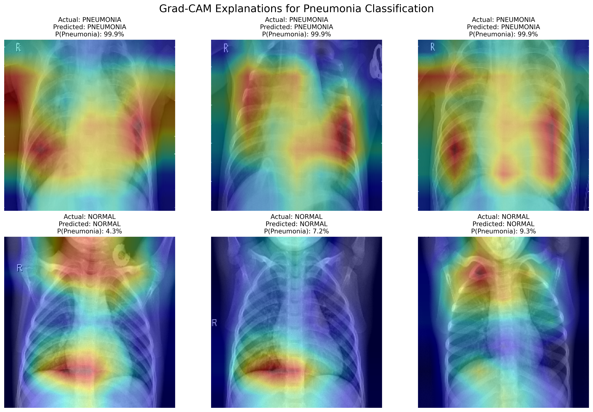
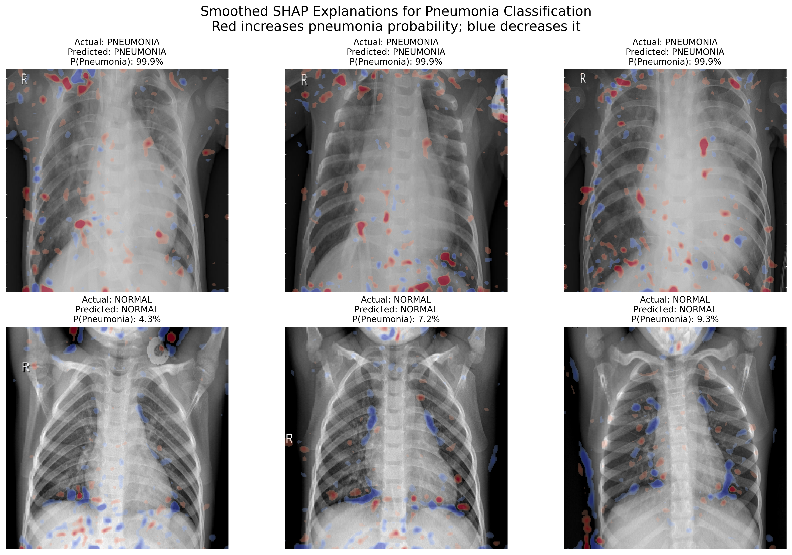
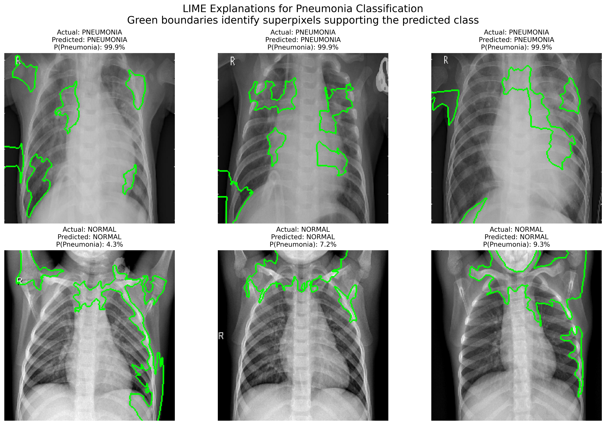

# 🩺 Explainable AI for Pneumonia Detection using Deep Learning

<p align="center">

**Transfer Learning • Medical Imaging • Explainable AI (XAI)**

*A complete educational project demonstrating how to interpret Convolutional Neural Networks using Grad-CAM, SHAP, and LIME.*

</p>

---

# 📖 Overview

Artificial Intelligence has demonstrated remarkable performance in medical image classification. However, most deep learning models operate as **black boxes**, making it difficult to understand **why** a prediction was made.

This repository demonstrates how **Explainable Artificial Intelligence (XAI)** techniques can improve the transparency of a Convolutional Neural Network (CNN) trained to detect **Pneumonia** from **Chest X-Ray images**.

The project trains a **MobileNetV2** model using **Transfer Learning**, then applies three popular explainability methods to the same trained model:

- 🔥 Grad-CAM
- 🟥 SHAP
- 🟩 LIME

The objective is to compare these methods and understand how modern deep learning models make medical imaging decisions.

---

# ✨ Features

| Feature | Included |
|:------------------------------|:------:|
| MobileNetV2 Transfer Learning | ✅ |
| CNN Binary Classification | ✅ |
| Model Evaluation | ✅ |
| Confusion Matrix | ✅ |
| Classification Report | ✅ |
| Grad-CAM | ✅ |
| SHAP | ✅ |
| Smoothed SHAP | ✅ |
| LIME | ✅ |
| Educational Code | ✅ |
| Fully Commented | ✅ |

---

# 🏗️ Workflow

```text
                 Chest X-Ray Images
                         │
                         ▼
           MobileNetV2 Transfer Learning
                         │
                         ▼
               Pneumonia Classification
                         │
        ┌────────────────┼────────────────┐
        ▼                ▼                ▼
     Grad-CAM          SHAP             LIME
        │                │                │
        ▼                ▼                ▼
 Attention Maps   Pixel Attribution  Superpixel Explanation
```

---

# 📂 Repository Structure

```text
MIA5100Z-Explainable-AI-Pneumonia-Detection/

│
├── train_cnn_gradcam.py
│
├── examples_cnn_gradcam.py
├── examples_cnn_shap.py
├── examples_cnn_shap_smooth.py
├── examples_cnn_lime.py
│
├── gradcam_report_images/
│   ├── gradcam_1_pneumonia_comparison.png
│   ├── gradcam_1_pneumonia_overlay.png
│   ├── ...
│   └── gradcam_six_examples_report.png
│
├── shap_report_images/
│   ├── shap_1_pneumonia_comparison.png
│   ├── shap_1_pneumonia_overlay.png
│   ├── ...
│   ├── shap_six_examples_report.png
│   └── shap_six_examples_smoothed_report.png
│
├── lime_report_images/
│   ├── lime_1_pneumonia_comparison.png
│   ├── lime_1_pneumonia_overlay.png
│   ├── ...
│   └── lime_six_examples_report.png
│
├── training_accuracy.png
├── requirements.txt
├── README.md
├── LICENSE
└── .gitignore
```

---

# 📊 CNN Training

<p align="center">

</p>

The CNN was trained using **Transfer Learning** with MobileNetV2.

Training and validation accuracy were monitored throughout the learning process to evaluate convergence and detect possible overfitting.

---

# 🔥 Grad-CAM

<p align="center">

</p>

Grad-CAM (Gradient-weighted Class Activation Mapping) highlights the image regions that most influenced the CNN prediction.

### Advantages

- Excellent localization
- Clinically intuitive
- Fast
- Specifically designed for CNNs

---

# 🟥 SHAP

<p align="center">

</p>

SHAP estimates the contribution of every image pixel to the final prediction.

- 🔴 Red increases the probability of Pneumonia.
- 🔵 Blue decreases the probability of Pneumonia.

This repository includes both the original SHAP implementation and an enhanced **smoothed SHAP visualization** that improves readability by grouping neighbouring attributions into coherent anatomical regions.

---

# 🟩 LIME

<p align="center">

</p>

LIME (Local Interpretable Model-Agnostic Explanations) divides the image into superpixels and identifies the regions that most strongly support the predicted class.

Unlike Grad-CAM, LIME is model agnostic and can be applied to virtually any image classifier.

---

# 📈 Explainability Comparison

| Method | Strengths | Limitations |
|---------|-----------|-------------|
| 🔥 Grad-CAM | Excellent localization | CNN-specific |
| 🟥 SHAP | Strong theoretical foundation | Computationally expensive |
| 🟥 Smoothed SHAP | Better visualization of anatomical regions | Visualization post-processing |
| 🟩 LIME | Model agnostic | Sensitive to segmentation parameters |

---

# 📥 Dataset

This repository **does not include the dataset**.

Please download the **Chest X-Ray Images (Pneumonia)** dataset from Kaggle:

https://www.kaggle.com/datasets/paultimothymooney/chest-xray-pneumonia

After extracting:

```text
project/

│
├── chest_xray/
│   ├── train/
│   ├── val/
│   └── test/
│
├── train_cnn_gradcam.py
└── ...
```

---

# ⚙️ Installation

Clone the repository:

```bash
git clone https://github.com/eduardo-delgado-yparraguirre/MIA5100Z-Explainable-AI-Pneumonia-Detection.git
```

Install the required libraries:

```bash
pip install -r requirements.txt
```

---

# 🚀 Usage

## Train the CNN

```bash
python train_cnn_gradcam.py
```

This script:

- trains the CNN
- evaluates the model
- saves the trained model

```
pneumonia_mobilenetv2_model.keras
```

---

## Generate Grad-CAM

```bash
python examples_cnn_gradcam.py
```

Results:

```
gradcam_report_images/
```

---

## Generate SHAP

```bash
python examples_cnn_shap.py
```

Results:

```
shap_report_images/
```

---

## Generate Smoothed SHAP

```bash
python examples_cnn_shap_smooth.py
```

Results:

```
shap_report_images/
```

---

## Generate LIME

```bash
python examples_cnn_lime.py
```

Results:

```
lime_report_images/
```

---

# 📚 Technologies

- Python
- TensorFlow / Keras
- MobileNetV2
- NumPy
- Matplotlib
- SHAP
- LIME
- SciPy
- Scikit-image
- Scikit-learn

---

# 🎓 Educational Purpose

This repository was developed as an educational project to demonstrate:

- Transfer Learning
- Medical Image Classification
- Explainable Artificial Intelligence (XAI)
- Model Interpretability
- Deep Learning Best Practices

The code has been intentionally written with extensive comments and modular scripts to support learning and experimentation.

---

# 🚀 Future Improvements

- Interactive Streamlit application
- Upload custom X-rays for prediction
- Combined Grad-CAM + SHAP + LIME dashboard
- Vision Transformers (ViTs)
- Multi-class chest disease classification
- Additional explainability techniques (Integrated Gradients, Score-CAM, Guided Backpropagation)

---

# 👨‍💻 Author

**Eduardo Delgado Yparraguirre**

Master of Engineering — Artificial Intelligence  
University of Ottawa

> **Note:** This educational project was developed with the assistance of generative AI tools. The code, documentation, and explanations were reviewed, tested, and adapted by the author.

---

# 🙏 Dataset Attribution

This project uses the **Chest X-Ray Images (Pneumonia)** dataset originally published by:

> Kermany, D., Zhang, K., & Goldbaum, M. (2018). *Labeled Optical Coherence Tomography (OCT) and Chest X-Ray Images for Classification.*

Dataset available from:

https://www.kaggle.com/datasets/paultimothymooney/chest-xray-pneumonia

Please cite the original dataset if you use it in your own research.

---

# 📄 License

This project is distributed under the **MIT License**.

---

<p align="center">

⭐ **If you found this repository useful, please consider giving it a star!**

</p>
